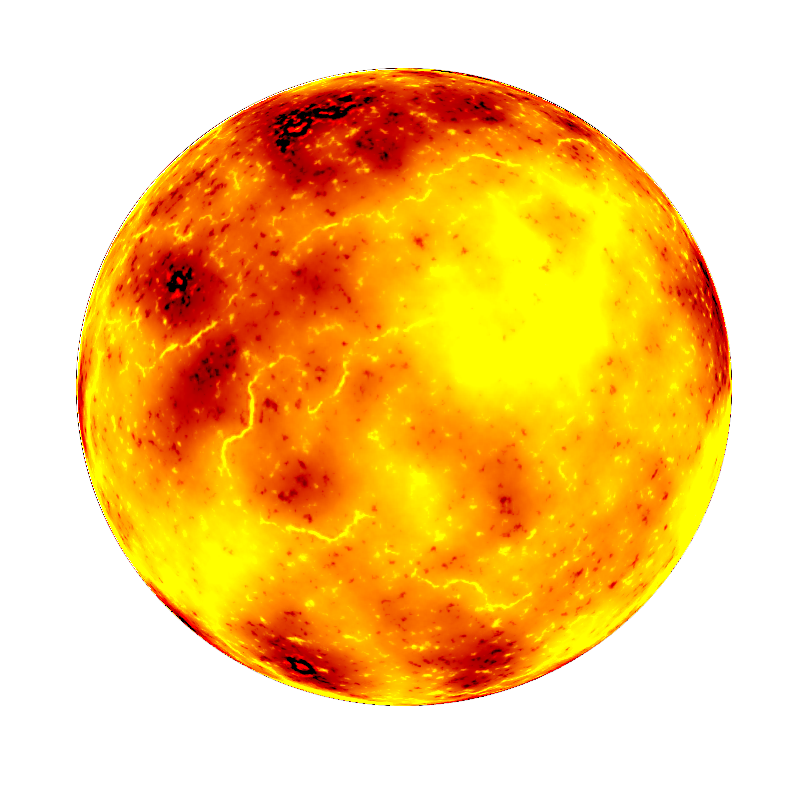

### Space Rodeo -- Final Report
__Note: The basic game information, related games and story, etc can be found in the design document of Space Rodeo__

[Design document -- Space Rodeo](https://github.com/mstrotta/space-rodeo/blob/master/designDoc.md)

__In this report, only game design detail and technical parts are included__

####Game Elements
* __Transition screens__
<table>
<tr><td>
 </td>
 <td></td></tr>
 </table>
 In these transition screens. Player has control on the game flow. He can start the game, exit the game, go to the next level (when finished one level), retry level (when failed one level) and go back to the main screen (when finished the game). 
 
 In start screen, we provide 2 more options -- CONTROL to show how to control the spaceship and CREDITS to give credits to the sources we used from Internet. 

In addition, these screens have animated outer-space background images.

* __Billy:__ 

	* Billy the goat is the main character of this game
	* Functions:
		* Launching: Billy starts its adventure in every game from launching its spaceship.
		* Burst: Billy uses burst to gain speed, to escape space effects such as planet gravity or to avoid asteroids. The number of bursts are limited in every level. 
		* Brake: Billy uses brake to slow down. Brake helps player better control Billy to avoid crashing or waiting for best timing. 
		* Lasso: Billy shoots lasso out in 3 directions -- 1) straight out 2)upwards 3)downwards -- to capture flying cows. 
		* Guideline: Player can view the guideline by pressing "SHIFT". The guideline will show the moving track of Billy including orbiting track and wormhole track. Guideline only works accurately within a limited range.
	* Animations available:
		* Burst
		* Brake
		* Crash
		* Lassos related (Shoot, hold, etc) 
* __Planet:__

	* Effects:
		* Billy can orbit planets to change its flying directions if it travels through the gravity field of the planet while not crashing it.
		* Billy will crash into the planet if it makes direct contact with the planet.
		* When Billy is orbiting the planet, the planet will pull Billy slowly towards it and eventually Billy will crash the plane unless Billy uses a burst to escape the planet gravity.
		* Planets can move themselves in circles.

* __Asteroid:__

	* Effects:
		* Asteroids can travel across the screen.
		* Billy will crash on asteroids and die.
		* Asteroids will crash when hitting other asteroids.
		* Asteroids will regenerate if they are crashed or out of screen

* __Wormhole:__

	* Wormholes always appear in pairs, each wormhole has a counterpart wormhole.
	* Effects:
		* The wormhole will teleport Billy to its counterpart.
		* The wormhole does not change the moving status (speed, direction) of Billy.
* __Space Ranch:__

	* Space Ranch is the key to next level. Billy has to reach the Space Ranch after collecting all the cows. 
* __Sun:__

	* Sun is just another Planet with different texture. We can simulate a solar system using the Sun model. 

####Design Decisions
* __Pseudo physics__
Orbiting planets in Space Rodeo uses pseudo physics. It will be very difficult to use real physics to implement the orbiting mechanism because It requires a strict speed to orbit the planet. Billy will easily pass the planet with a little bending or simply crash on the planets. Using pseudo physics make the game more fun and meaningful. 
* __Burst__
Burst uses real physics. Once Billy speeds up, the speed will not drop to the original value. However, player can use brake to decelerate Billy.
* __Brake__
Brake is a mechanism to reduce the difficulty. Player uses brake to avoid obstacles like asteroids. Player has unlimited use of brake, which will slow down Billy, providing better timing.
* __Guideline__
As there are certain hidden information such as the gravity field of a planet and the pair information of wormholes, player needs to be equipped with these information to finish a level. We use guideline not only to reduce the game difficulty, but also provide necessary information for the player to finish a level.

####Implementations
* Game Framework: MVC

[MVC in Wikipedia](http://en.wikipedia.org/wiki/Model%E2%80%93view%E2%80%93controller)

	* Models: Store all objects in the game.
	* View: Take Models as input and render all objects
	* Controller: Take user input and make corresponding change to Models.
* Transition screens:
	* There are finite state, such as START, RETRY, EXIT, etc. States are updated when using keyboards to select the options displayed in the screen
	* View class will render selection icon according to states. 
* Orbit:
	* Billy starts orbiting when it is in the gravity field of a planet, and when the speed of Billy is perpendicular to the line connecting Billy and the planet.
	* Angular Velocity is calculated and set when Billy starts to Orbit. The speed are then updated using this angular velocity. 
* Lasso:
	* Lasso shoots out in 3 directions. The target position is remembered and the lasso travels to the target in certain speed.
	* Lasso will go back when the target position is reached or a cow is reached in the middle. The new target position keeps updating, which is just the position of Billy.
* Wormhole
	* To avoid jumping between 2 wormholes forever, the 2 wormholes involved will be locked until the spaceship no longer collides with them.
* Guideline
	* Guideline is composed of line segments, which is stored in a sf::VertexArray vector. And the points representing the dotted lines are stored in another vector of sf::Vector2f
	* The collision is precomputed based on the direction of Billy.

####Challenges and solutions
* __Make a flexible framework__
We realized that make a framework is important to the game, especially when we want to slowly grow the game to certain level. Instead of simply writing some running code, we carefully chose and implement the framework. It turns out to be a very effective one. It saves a lot of time and work. 
* __Orbit__
We evolved the way we used to implement the orbiting mechanism. Firstly, the orbiting is implemented by changing the center of the spaceship object and use "rotate" function. This provides good orbit motion. However, it introduces many troubles when doing collision detection. Then we use vector-based mechanism by calculating the angular speed and change corresponding x and y speed values. However, we find there is a jump gap when entering the orbit state. This is addressed then by starting orbit only when the angle between speed of Billy and the line connecting Billy and the center of the planet is around 90 degrees.
* __Guideline__
Guideline is difficult to implement because we need to precompute the collision and draw a good dotted line (might be straight or curly). 
* __Mathematical computation__
The game involves much mathematical computation when calculating the movement. One example is the orbiting. Billy needs to orbit the planet even when the planet itself is moving. These computations will take much time to test and modify.
####Team Collaborations
* Team members should provide interfaces to interact with other members to avoid messing the code up.
* Version control should be extensively used. It keeps every member being informed the latest change and progress. It also help rollback to old implementations. 
* Any ad-hoc solution should be avoided. It not only introduce problems in future implementations but also introduce problems to other team members. 
####Future works
* More levels and space effects can be added to make this game more complex.
* More animations
* More original art
* Make a tutorial to teach the player how to play the game and introduce various space effects. 
