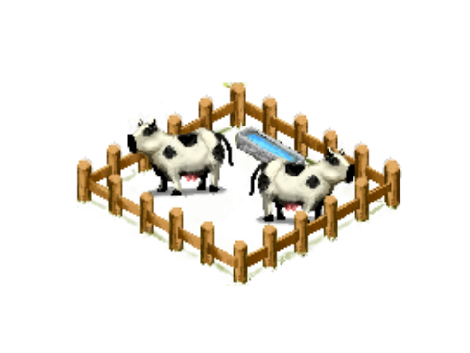
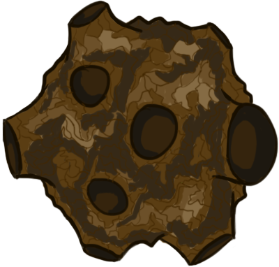

__Space Rodeo - Design Document__ 

----------
### __1. Title page__

----------
####__Space Rodeo__####
####__--Would you like fries with that milkshake?__####
####__Members:__####

* Yue Li
* Michael Trotta
* Kate Quinn
* Joseph Soultanis

####__Oct 15, 2014__####

### __2. Executive summary__

----------

Earth’s cows have been abducted into space by an Extraterrestrial Evil Cow Overlord and, if nothing is done to stop him, will be used as part of his Mad Cow army. The courageous cowgoat Billy the Kid ventures from his Wild West home into space to round up the lost cows. Along the way he must master and make use of the physics of the Milky Way.

### __3. Overview__

----------

   * Title: Space Rodeo
   * Tagline: “Would you like fries with that milkshake?”
   * Team Members: Yue Li, Michael Trotta, Kate Quinn, Joe Soultanis
   * Genre: Physics Puzzles
   * Platform: PC
   * Market: Ages 7 to 50
   * Setting: Space
   * Plays like: Angry Birds meets Run from the Sun with a Western theme

### __4. Related Games__

----------

####__Angry Birds__
* __Developer:__ Rovio Entertainment
* __Platform:__ Apple iOS
* __Year:__ 2009
* The game has been called “the largest mobile app success the world has seen,” and the mobile app has inspired an entire franchise of related work, including a television series and an Angry Birds Space-themed park at Kennedy and Houston NASA Space Centers. Look for a Sony Pictures Entertainment animated film in 2016.

#### __Cows in Space__

 * __Developer:__ Donut Games
 * __Platform:__ Apple iOS
 * __Year:__ 2014
 * Similar to Space Rodeo in theme: cows are floating around in space and must be teleported back to Earth. The gameplay is a puzzle game where the player shoots projectiles from a left-right moving shooter to try to knock cows into stars in a Peggle/Pong-type game. There are some interesting gravity mechanics that we may use for inspiration.

####__Run from the Sun__
* Publisher: Armor Games
* Platform: PC
* Year: 2011
* Player controls a space ship, which they launch from one planet to another in a side-scrolling journey, racking up points for distance and other achievements. Players must time the firing of a rocket pulse with the rotation of a planet in order to succeed. Ship upgrades are given for points.

###__5. Player composition__

----------

__General__
Space Rodeo is targeted to casual gamers between age 7 and 50 who enjoy addictive puzzles such as Angry Birds. Players play the game during down-time at work or at school on their PC's. Play time is therefore limited to about 10 minutes per session, 3-5 times per week until completing the game. The difficulty of each level must be such that each level can be beaten by the average player in less than 10 minutes. The goal is to keep the player excited to return to the game when they have another block of free time, so each successive level must contain a new or interesting challenge that has not been seen before.
    
Players likely find out about the game through social media or through gaming websites such as addictingGames.com. The game is free to play.

Addicting gameplay and the desire to overcome the puzzle of each level is the primary driver for gameplay, but the inclusion of a playful cartoon theme will serve to give personality to the game and may become the foundation of a franchise much the way Angry Birds has become a franchise.

__Player profiles:__
    
Brian, a 42 year-old male, catches his obviously frustrated coworker playing Space Rodeo before their meeting gets started at the office. He is more than a little intrigued by his coworker's explanation: “I didn't have enough rocket boosts to capture the 9th cow.” Brian has a history of playing Facebook games, and he determines to look into the new game when he gets some free time.

Owen, a 8 year-old male student, has discovered a passion for online flash games in the computer lab during his after-school program. He comes across Space Rodeo and begins playing it side-by-side a few friends consistently after school for a week and a half until he has beaten the game.

Jessica is an 18 year-old college student who would rather do anything on her open laptop but take notes from her Psychology professor's lecture.  She has consequently endeavored to beat as many levels as possible from Space Rodeo, which her like-minded classmate has just linked her, as the 80 minute lecture period affords.

### __6. World__

----------
The game takes place in our own Milky Way galaxy. However, Billy the Kid must venture farther and farther from his home planet, Earth, and its surrounding solar system in his relentless pursuit of Earth's cows. In his world, many animals are anthropomorphized to speak English and engage in human-like activities such as playing checkers and rounding up cattle. Others, such as the Evil Cow Overlord, come from distant galaxies and thus have unnatural abilities and technologies and inexplicably evil intentions. However, some animals retain their natural animalistic natures, such as the cows which are the object of Billy the Kid's round-ups.

There also exist far more unique space effects such as black holes, worm holes, and asteroids than the scientists of our own Earth believe exist

### __7. Characters__

----------

Billy the Kid draws quicker, spits farther, and shoots straighter than any other goat in Texas. He's a true Western cowboy and has proved a mighty fine sheriff of his town, where he's rounded up villain and bovine like for the past few years. You'll find him walking on hind-legs, lasso on his hip, characteristic red neckerchief about his neck, well-polished sheriff star on his breast, and hat sitting neatly around his polished horns. This white goat with brown patches has earned a name for himself in the West, but he'll have to prove he can hold his own across the entire Milky Way in short time, since all of Earth's cows have been mysteriously abducted. Billy has no interest in his species becoming Earth's de facto dairy producer, so he must take Huston's newly minted space ship and try to recover them.

The Evil Cow Overlord is a mysterious bovine extraterrestrial who has appeared in the Milky Way Galaxy uninvited and intends to use Earth's cows for nefarious purposes. He is a characteristically large dairy cow with intimidating horns, mad red eyes, and the propensity to shoot milk at any enemy that he may engage with. His plan is to turn Earth's cows into his own Mad Cow minions through some sort of mind control.

###__8. Progression graph__

----------

###__9. Art direction__

----------

We designs our art in an Angry Bird style. __Examples__ are as follows:

###__10.UI story boards__

----------

__Sample Sketch:__

###__11.Tags & Dialog__

----------

__TAGS:__

__Puzzle Solution__

__Collection__

__Lasso__

__Casual Game__

__DIALOG EXAMPLES:__

"You haven't seen the last of us!"

"MOOOOOOOO"

"Another day, another lasso"

###__12.Technology plan__

----------

We will simply use SFML to implement our game. No further technology or library is needed.

###__13.Software architecture__

----------

__Software architecture:__

We use MVC framework to model our game.

__Model:__ Model calss will store all elements in the game. It maintains a big vectors to store all the objects in the game.

__View:__ View class is in charge of rendering. It takes input from Model class, classify the objects into multiple vectors, and draw the objects and their special features

__Controller:__ It takes input from the user (Key strokes) and update the models according to the input. It also updates the models in intervals. 

###__14.Controls__
We control the spaceship of Billy traveling in the space. Player almost loses control of track of the space after firing it with 2 exceptions -- bursts that can escape the gravity of a planet and speed up and -- Brakes that decelerate the spaceship. Player has the ability to shoot lassos when flying to collect cows. Player needs to plan ahead to make good use of limited bursts to collect all cows and eventually fly to the destination of each level -- Space Ranch. There are 4 kinds of control.

* __Launching:__ In each level, there is a starting point at which the spaceship can be shot into the space. Player presses "left" and "right" arrows to change the direction. Afterward player press "enter" to launch the spaceship.
* __Burst:__ Player has limited burst in each level. The burst number depends on the spaceship Billy owns. When using a burst (press "space") , the spaceship can temporarily escape the space effect (escape orbiting a planet or escape black holes). 
* __Shoot Lasso:__ When spaceship is flying, player can press "up", "left", or "right" to shoot a lasso in corresponding direction to capture flying mad cows. 
* __Brake:__ When spaceship is in motion, player can press "down" to brake. Brake enables the spaceship to decelerate. Player has unlimited use of brake.

----------

###__15.Level design__

----------

Space Rodeo has multiple levels. To reach the next level, player has to collect all of cows in the current level, as well as reach the destination -- Space Ranch --  of the current level. In each level, player will deal with various space effect. An illustration is shown below

The first of this figure shows the most basic level, player simply fires the spaceship in the direction of Space Ranch, collecting the cow when flying through it or lasso it. Then the level is finished. The second graph shows a more advanced level. In order to finish this level, player needs to deliberate how to capture the flying mad cow and reaches the Space Ranch while not crashing on the obstacles. In this level, player can take advantage of the gravity of the planet to change its track. 

###__16.Mechanics analysis__

----------
* __Map Objectives:__ Player must capture a all cows on each level and reach the Space Ranch on the map. He lassos cows by traveling through them or shooting a lasso rope in one direction
* __Survival:__ Player has finite number of lives which are lost upon crashes into objects or when out of the map edges
* __Movement:__ Player controls his space ship’s movement by rotating his ship and by firing a rocket. He may take advantage of planet gravity to orbit planets, and use burst to escape the orbiting.
* __Gravity:__ Planet in the map has gravity impact on the spaceship, which will lead to crash, or orbit depending on the track of the spaceship. Spaceship will also be pulled toward the planet slowly so player cannot wait too long before escaping a planet.
* __Space Effects:__ Player must engage with various space effects such as worm holes (map teleportation effect) and deadly asteroids.
* __Burst:__ Player has limited number of bursts to alter the track of spaceship in order to collect more cows or avoid dangers. 

###__17.Schedule__

> Oct 17 -- Game prototype and skeleton

> Oct 22 -- Basic sprites

> Oct 22 -- Milestone: game playable and tolerable visuals

> Oct 23 -- Progress presentation

> Nov 7 --  Enrich elements and levels 

> Nov 10 -- Sounds and music

> Nov 10 -- Milestone: Game roughly look like the final version

> Nov 11 -- Progress presentation

> Nov 21 -- Improve sprites, elements and levels

> Nov 23 -- Testing and Refining

> Nov 24 -- Final presentation and demo

> Nov 28 -- Final refinement

> Nov 28 -- Milestone: Game complete

> Dec 4 -- Final report 

###__18.Budget__
4 People, 3 Months
###__19.Changelog__
####__Report on Oct 23, 2014__
__Highlight:__ 
* __Clarify:__ Game is now a pure puzzle game
* __Work has been done:__ Build MVC framework, game playable by firing rockets to go to the space ranch. Player can collect cows by traveling through them. 
* __Core functionality remaining:__ Lasso, and more enhancement.

[click here to read complete report](https://github.com/mstrotta/space-rodeo/blob/master/Report_10_23.md)

####__Report on Nov 10, 2014__
__Highlight:__ 
* __Game enhencement__: Added Lasso and animation, various space effect. More levels are implemented. 
* __TODO__: More levels, space effects. Game start and game over screen, level transitions. 

[click here to read complete report](https://github.com/mstrotta/space-rodeo/blob/master/Report_11_10.md)

####__Report on Nov 24, 2014__
__Highlight__
* __A real Billy__
* __Smooth orbit__
* __Guidline__
* __Brake__
* __Moving Planet and Planet Gravity__
* __More animations__:crash, rope, lasso, background, burst, brake
* __Transition screens__
* __More levels (6 in total)__
* __Music and more sound effects__

[click here to read complete report](https://github.com/mstrotta/space-rodeo/blob/master/Report_11_24.md)

